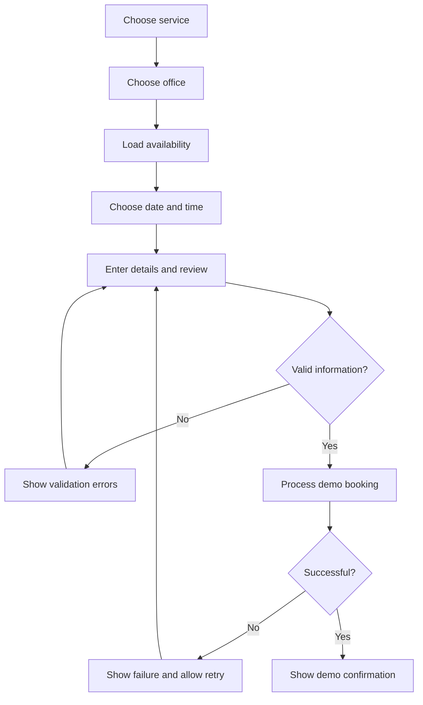

# Appointment Booking Flow

```mermaid
flowchart TD
    A[Choose service] --> B[Choose office]
    B --> C[Load availability]
    C --> D[Choose date and time]
    D --> E[Enter details and review]
    E --> F{Valid information?}
    F -->|No| G[Show validation errors]
    G --> E
    F -->|Yes| H[Process demo booking]
    H --> I{Successful?}
    I -->|No| J[Show failure and allow retry]
    J --> E
    I -->|Yes| K[Show demo confirmation]
```

Back and Change actions return users to earlier steps. Valid information is preserved; changing an office clears its previous date and time.
